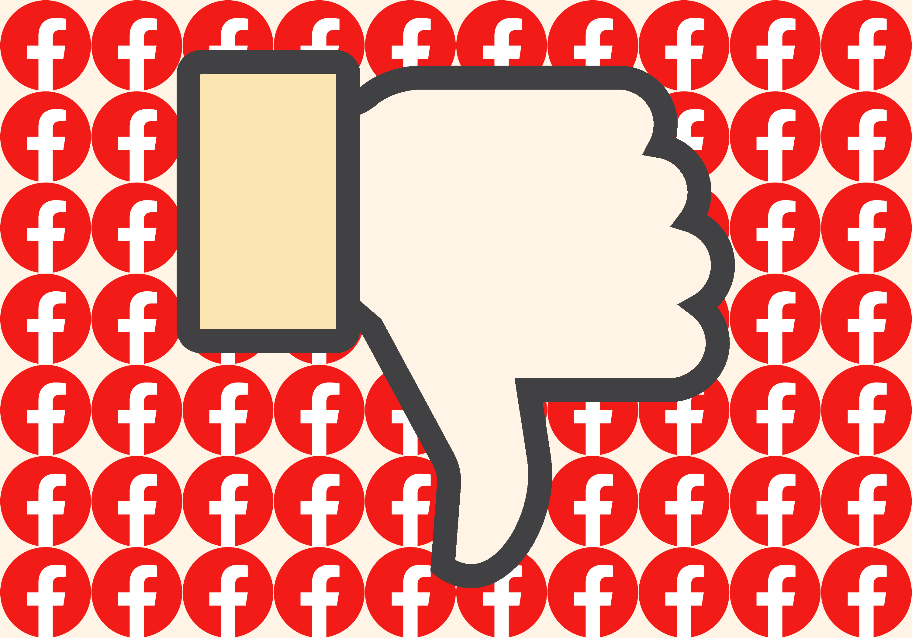

# Non-Commercial, Open Source, and Federated Social Platforms as Effective Community Alternatives

## Comparing the design philosophies and aggregative behavior of commercial and non-commercial, federated social media services.

I'm writing an academic article about Open Web social platforms/technologies' superiority to the big proprietary players for a class, so I thought I'd play around with documenting it as I work on it (read: setting up this repository was a great distraction from actually *working on the fucking essay*.)

See: "[Should scientific publishing move to Github and friends](https://grasshoppermouse.github.io/2019/07/12/should-scientific-publishing-move-to-github-and-friends/)?"

#### [Contribute and or Review via Google Docs](https://docs.google.com/document/d/1wvkAvfP3rdKZiA0UuGRNFI-bBs41CPRCawwaAW3k7uc/edit?usp=sharing)

You can also track live revisions on [**the new channel**](https://discord.gg/K8bg95jRvW) I created in *Extratone*'s Discord for this purpose.

## ※※※ [**Current Essay Draft**](EssayDraft.md) ※※※

[**David Blue vs. Big Blue**](vsbigblue.md) - A *big* draft of an essay I spent a large portion of the Summer working on and originally intended to post personally. 
Its [Notes Page](vsnotes.md) is especially important.

## Live Progress

* [Notion Page (Notes)](https://www.notion.so/rotund/Research-Paper-4e71ec99e6bd45bcb53713c0a3bdc7fa)
* [Raindrop Bookmarks Collection](https://raindrop.io/collection/14829126) | ([RSS](https://raindrop.io/collection/14829126/feed))
* [Word Draft](https://eileenlong-my.sharepoint.com/:w:/g/personal/david_eileenlonglcsw_com/EcnB_3AfhsZHmGj0GYgT65cBAfKKCTbViZNpuh8aykciDA?e=cbYpkN)
* [Working Bibliography](sources\Bibliography.md)
* **[Voice Note](0.3VoiceNote.mp3)** on an upcoming release (0.3.)
* **[Audio recording](JackOnStream.mp3)** of my conversation with Jack [on stream, 11-24-2020](https://youtu.be/1sCxxZ35ZHY).

# Working Abstract

This essay seeks to examine the breadth of donor-funded, open source, federated social networks as technical alternatives to commercial online environments like Facebook and Twitter as measured by their users’ overall satisfaction with them as means of social interactivity over time. Following recent debates and confusion regarding the ethics in the practices of the organizations which built them and the extent of their complicity in the radical cultural consequences of digital communication surrounding the United States’ Presidential Election in 2016, it proposes that greater rhetorical and legislative attention be invested in the tangible, documented design decisions across their products’ history as the most crucial, relevant, and effective means of understanding the whole context, within which it will define open source software development and federated networking in contrast to the guarded industry establishment which the dominant services have transitioned from disrupting by design to entirely exemplifying thus far in the century. After examining conspicuous alterations and inexplicably silent feature additions and subtractions across the whole of social network development, as well as their eventual result’s reflections on the conscious satisfaction of individual social media users, it will conclude by profiling a select few communities thriving on donation-funded, collaboratively-maintained, and/or decentralized platforms as superior foundations upon which citizens of the web might rebuild their own traumatized and fragmented networks when they are ready to begin again.

# Working Bibliography

Barbrook, Richard and Andy Cameron. "The Californian Ideology." *Mute* 1 September 1995. Web. <https://www.metamute.org/editorial/articles/californian-ideology>.

Barlow, John Perry. "A Declaration of the Independence of Cyberspace." 1996. *Electronic Frontier Foundation.* Web. 16 11 2020. <https://www.eff.org/cyberspace-independence>.

Bauerlein, Monica and Clara Jeffery. "Facebook Manipulated the News You See to Appease Republicans, Insiders Say." *Mother Jones* 21 October 2019. Web. <https://www.motherjones.com/media/2020/10/facebook-mother-jones/>.

*BBS: The Documentary*. Dir. Jason Scott. 2005. Streaming Video. <http://www.bbsdocumentary.com/>.

Bell, Emily and Taylor Owen. "The Platform Press: How Silicon Valley reengineered journalism." *Columbia Journalism Review* 29 March 2017. Web. <https://www.cjr.org/tow_center_reports/platform-press-how-silicon-valley-reengineered-journalism.php>.

Bell, Emily. "For Facebook, a boycott and a long, drawn-out reckoning." *Columbia Journalism Review* 9 July 2020. Web. <https://www.cjr.org/tow_center/for-facebook-a-boycott-and-a-long-drawn-out-reckoning.php>.

Brandom, Russell. "Facebook boycott organizers call Mark Zuckerberg meeting ‘a disappointment’." *The Verge* 7 July 2020. Web. <https://www.theverge.com/2020/7/7/21316492/facebook-boycott-stophateforprofit-hate-moderation-meeting>.

Clegg, Nick. "Facebook Does Not Benefit From Hate." *Facebook Blog* 1 July 2020. Web. <https://about.fb.com/news/2020/07/facebook-does-not-benefit-from-hate/>.

Cole, Samantha. "2.1 Million of the Oldest Internet Posts Are Now Online for Anyone to Read." *Vice* 13 October 2020. Web. <https://www.vice.com/en/article/pky7km/usenet-archive-utzoo-online>.

Dail, James. "Regulating Social Media as a Public Utility." *Claremont Journal of Law and Public Policy* (2018). Web. <https://5clpp.com/2018/04/23/regulating-social-media-as-a-public-utility/>.

"Declaring Facebook a Utility Wouldn’t Assuage Users’ Concerns." *National Review* 29 May 2019. Web. <https://www.nationalreview.com/2019/05/declaring-facebook-a-utility-wouldnt-assuage-users-concerns/>.

Domino, Jenny. *Talking with Jenny Domino about Facebook and Hate Speech* Matthew Ingram. Columbia Journalism Review, 9 August 2020. Web Forum. <https://galley.cjr.org/public/conversations/-MCMWotYsoJWReJCftkR>.

Edosomwan, Simeon. "The History of Social Media and its Impact on Business." *The Journal of Applied Management and Entrepreneurship* 16 November 2011. Web. <http://www.minot.com/tom/SocialMedia.pdf>.

Feldman, Brian. "Facebook Doesn’t Need to Fix Society. It Just Needs to Fix Facebook." *New York Magazine* 31 December 2018. Web. <https://nymag.com/intelligencer/2018/12/facebook-doesnt-need-to-fix-society.html>.

Fisher, Christine. "Wikipedia co-founder wants to give you an alternative to Facebook and Twitter." *Engadget* 14 November 2019. Web. <https://www.engadget.com/2019-11-14-wtsocial-wikipedia-wales-facebook-alternative.html>.

French, Alex. "Boy Genius of the Year: Do You Trust This Face?" *GQ* 1 November 2008. Web. <https://www.gq.com/story/boy-genius-of-the-year-mark-zuckerberg-facebook>.

Goble, Gordon. *The history of social networking*. n.d. 16 11 2020. <http://www.digitaltrends.com/features/the-history-of-social-networking/>.

Grossman, Lev. "Inside Facebook's Plan to Wire The World." *Time Magazine* 4 December 2014. Web. <https://time.com/facebook-world-plan/>.

Hall, Justin. *The “First” Blogger, Justin Hall* Brian McCullough. 11 June 2017. Podcast. <http://www.internethistorypodcast.com/2017/06/the-first-blog-justin-hall/>.

Hsu, Tiffany. "Ad Boycott of Facebook Keeps Growing." *The New York Times* 23 June 2020. Web. <https://www.nytimes.com/2020/06/23/business/media/facebook-ad-boycott.html>.

Isaac, Mike. "Facebook’s Decisions Were ‘Setbacks for Civil Rights,’ Audit Finds." *The New York Times* 8 July 2020. Web. <https://www.nytimes.com/2020/07/08/technology/facebook-civil-rights-audit.html?utm_campaign=The%20Interface&utm_medium=email&utm_source=Revue%20newsletter>.

Jeong, Sarah. "Mastodon Is Like Twitter Without Nazis, So Why Are We Not Using It?" *Vice* 4 April 2017. Web. <https://www.vice.com/en/article/783akg/mastodon-is-like-twitter-without-nazis-so-why-are-we-not-using-it>.

—. "Mastodon Is Like Twitter Without Nazis, So Why Are We Not Using It?" *WIRED* 4 April 2017. Web. <https://www.vice.com/en/article/783akg/mastodon-is-like-twitter-without-nazis-so-why-are-we-not-using-it>.

Kang, Cecilia and Mike Isaac. "Defiant Zuckerberg Says Facebook Won’t Police Political Speech." *The New York Times* 17 October 2019. Web. <https://www.nytimes.com/2019/10/17/business/zuckerberg-facebook-free-speech.html>.

Lee, Micah. "Helm Is a Private Home Email Server Anyone Can Use." *The Intercept* 30 April 2019. Web. <https://theintercept.com/2019/04/30/helm-email-server/>.

Lewis, Peter H. "The Compuserve Edge: Delicate Data Balance." *The New York Times* 29 November 1994. Web. <https://www.nytimes.com/1994/11/29/science/personal-computers-the-compuserve-edge-delicate-data-balance.html>.

Marantz, Andrew. "Why Facebook Can't Fix Itself." *The New Yorker* 12 October 2020. Web. <https://www.newyorker.com/magazine/2020/10/19/why-facebook-cant-fix-itself>.

Marino, Andrew. "How far will Facebook go to address their civil rights audit?" *The Verge* 14 July 2020. Web. <https://www.theverge.com/2020/7/14/21323988/vergecast-podcast-interview-rashad-robinson-color-of-change-facebook-ad-boycott>.

Newton, Casey. "Facebook gets in a Twitter tangle." *The Interface* 21 July 2020. Newsletter. <https://www.getrevue.co/profile/caseynewton/issues/facebook-gets-in-a-twitter-tangle-265375>.

—. "Mastodon.social is an open-source Twitter competitor that’s growing like crazy." *The Verge* 4 April 2017. Web. <https://www.theverge.com/2017/4/4/15177856/mastodon-social-network-twitter-clone>.

Open Source Initiative. "The Open Source Definition." 22 March 2007. *Open Source Initiative.* Web. 15 November 2020. <https://opensource.org/docs/osd>.

"Open Web Foundation." 25 July 2008. *Open Web Foundation.* Web. <http://www.openwebfoundation.org/>.

Osnos, Evan. "Facebook and the Age of Manipulation." *The New Yorker* 16 November 2018. Web. <https://www.newyorker.com/news/daily-comment/facebook-and-the-age-of-manipulation>.

*overshare: the links.net story*. Perf. Justin Hall. 2015. Video. 01 11 2020. <https://youtu.be/AxD4mqFtySQ>.

Paul, Kari. "Mark Zuckerberg and Jack Dorsey face Senate grilling over tech platforms – as it happened." *The Guardian* 17 November 2020. Web. <https://www.theguardian.com/technology/live/2020/nov/17/facebook-twitter-hearing-mark-zuckerberg-jack-dorsey-congress-latest-election-news>.

Perrin, Andrew. "Americans are changing their relationship with Facebook." Survey. 2018. Web. <https://www.pewresearch.org/fact-tank/2018/09/05/americans-are-changing-their-relationship-with-facebook/>.

Read, Max. "Group Chats Are Making the Internet Fun Again." *New York Magazine* 14 May 2019. Web. <https://nymag.com/intelligencer/2019/05/group-chats-are-making-the-internet-fun-again.html>.

Rhodes, Margaret. "Social Media Upstart Mastodon Is Like Twitter, Except Way More Civil." *WIRED* 13 April 2017. Web. <https://www.wired.com/2017/04/like-twitter-hate-trolls-try-mastodon/>.

Robertson, Adi. "How the biggest decentralized social network is dealing with its Nazi problem." *The Verge* 12 July 2019. Web. <https://www.theverge.com/2019/7/12/20691957/mastodon-decentralized-social-network-gab-migration-fediverse-app-blocking>.

Rochko, Eugen. *Mastodon: Federated Social Network with Eugen Rochko* Jeff Meyerson. Software Engineering Daily, 12 April 2018. Podcast. 15 November 2020. <https://softwareengineeringdaily.com/2018/04/12/mastodon-federated-social-network-with-eugen-rochko/>.

Romano, Aja. "At long last, Twitter brought back chronological timelines. Here’s why they’re so beloved." *Vox* 20 September 2018. Web. <https://www.vox.com/culture/2018/9/20/17876098/twitter-chronological-timeline-back-finally>.

Roose, Kevin. "Can Social Media Be Saved?" *The New York Times* 28 March 2018. Web. <https://www.nytimes.com/2018/03/28/technology/social-media-privacy.html>.

Satyal, Parimal. "Against an Increasingly User-Hostile Web." 2 November 2017. *Parimal Satyal.* Web. <https://neustadt.fr/essays/against-a-user-hostile-web/>.

Scola, Nancy. "Inside the Ad Boycott That Has Facebook on the Defensive." *POLITICO* 3 July 2020. Web. <https://www.politico.com/news/magazine/2020/07/03/activists-advertising-boycott-facebook-348528>.

Shah, Saqib. "The history of social networking." *Digital Trends* 14 May 2016. Web. <https://www.digitaltrends.com/features/the-history-of-social-networking/>.

Shapiro, Bruce. "Don’t Delete Facebook, Regulate It." *The Nation* 22 March 2018. Web. <https://www.thenation.com/article/archive/dont-delete-facebook-regulate-it/>.

Silverman, Jacob. "A Most Violent Platform." *The Baffler* 1 September 2020. Web. <https://thebaffler.com/the-future-sucked/a-most-violent-platform-silverman>.

Smith, Ben. "What’s Facebook’s Deal With Donald Trump?" *The New York Times* 21 June 2020. Web. <https://www.nytimes.com/2020/06/21/business/media/facebook-donald-trump-mark-zuckerberg.html>.

Susarla, Anjana. "Facebook shifting from open platform to public utility." *United Press International* 17 August 2018. Web. <https://www.upi.com/Top_News/Voices/2018/08/17/Facebook-shifting-from-open-platform-to-public-utility/1721534507642/>.

*The Facebook Dilemma*. By Anya Bourg, James Jacoby and Dana Priest. Dir. James Jacoby. The Public Broadcasting Corporation. Prods. Anya Bourg and James Jacoby. 2018. Television. <https://www.pbs.org/wgbh/frontline/film/facebook-dilemma/>.

"Third Position on The Web." *Southern Poverty Law Center* 22 February 2015. Web. <https://www.splcenter.org/fighting-hate/intelligence-report/2015/third-position-web>.

"'Too big to fail:' why even a historic ad boycott won't change Facebook." *The Guardian* 11 July 2020. Web. <https://www.theguardian.com/technology/2020/jul/10/facebook-ad-boycott-mark-zuckerberg-activism-change>.

Wildman, Steven S. and Jonathan A. Obar. "Social media definition and the governance challenge-an introduction to the special issue." *Telecommunications Policy* 22 July 2015. Web. <https://papers.ssrn.com/sol3/papers.cfm?abstract_id=2647377>.